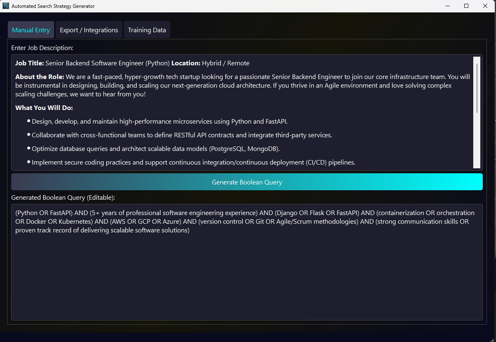

<div align="center">
  

  # 🔍 Automated Search Strategy Generator & Resume Analyzer
  
  **University of London (CM3070) Final Project • Natural Language Processing • Recruitment AI**

  [](https://www.python.org/)
  [](https://pytorch.org/)
  [](https://huggingface.co/)
  [](https://ai.meta.com/llama/)
</div>

---

## 🏛️ Project Context & Vision

Welcome to the repository for my final project for the **CM3070 module at the University of London**. 

For this capstone, the university mandates selecting from a strict, predefined list of project briefs. While this limits foundational conceptual creativity, it provides an excellent canvas for rigorous technical execution. I have a profound passion for working with Large Language Models, so I selected this framework and focused entirely on engineering a top-tier, robust, and highly optimized AI application.

This system leverages a **fine-tuned T5 model** to intelligently translate natural language job descriptions into mathematically optimized Boolean search strings. It then employs advanced semantic similarity scoring to dynamically rank candidate resumes against these queries, all wrapped within a streamlined **PyQt5** graphical interface.

---

## ⚖️ Ethical AI & Data Privacy

In the realm of HR and recruitment technology, data privacy is absolute. 

To ensure zero risk of exposing PII (Personally Identifiable Information) or compromising real user data, **the entire candidate database used in this project is 100% synthetic**. 

I utilized **Meta's Llama 3B model** to architect and generate a highly realistic, diverse, and robust fake dataset of resumes and candidate profiles. You can run, test, and push this application to its limits with the complete assurance that no real-world privacy boundaries are crossed. 

Any similarity or match to real-world individuals or real candidate data, if it occurs, is accidental, unintended, and purely coincidental.

---

## 🗄️ Architecture & Asset Management (6-7GB)

> **⚠️ CRITICAL NOTICE: EXTERNAL ASSET DOWNLOAD REQUIRED**
> Due to the comprehensive nature of the models and datasets, the complete project environment exceeds 6-7GB. To maintain repository performance and comply with GitHub's storage constraints, heavy assets have been decoupled from this repository.

**This repository does NOT contain:**
* The original base T5 model
* The fine-tuned T5 model weights
* The complete, uncompressed training dataset
* The Llama-generated local database files

### 📥 Integration Protocol
To experience the complete application:
1. Clone this repository to your local machine.
2. Access the **[Official Public Google Drive Repository](https://drive.google.com/drive/folders/1KLy-QelQcfzYedVWRlSyF703hmQI8zKr?usp=sharing)**.
3. Download the missing directories and files.
4. Mount them directly into the root directory of your cloned repository.

---

## ✨ Core Capabilities

* **🧠 Algorithmic Boolean Generation:** Transforms dense, natural-language job descriptions into precise, optimized Boolean search parameters using a custom fine-tuned T5 architecture.
* **📐 Hybrid Semantic Ranking:** Merges rigid Boolean logic with deep-learning semantic similarity metrics to evaluate, score, and rank candidate resumes with high fidelity.
* **🖥️ Qt-Powered Graphical Interface:** A sleek, low-latency PyQt5 application granting users the ability to:
    * Input or paste raw job descriptions.
    * Generate, audit, and manually refine Boolean strings.
    * Execute searches against the synthetic local dataset (`candidate_resumes.csv`).
    * Preview and export optimized candidate shortlists.
* **🔄 Extensible Training Pipeline:** Includes native scripts to further fine-tune the T5 model using proprietary datasets (`Cleaned_Dataset.csv`).

---

## 💻 Environment Setup & Execution

### 1. Dependency Installation
A consistent environment is critical. Ensure Python 3.7+ is active, then initialize the requirements:

```bash
pip install -r requirements.txt
```

### 2. Launching the Interface
Once the Drive assets are mounted in the root folder, execute the main application:

```bash
python automated_search_strategy_generator.py
```
* **Input:** Paste your target job description.
* **Process:** Click **Generate Boolean Query** to initialize the T5 inference.
* **Refine:** Adjust the output parameters manually if required.
* **Execute:** Click **Search Local Candidates** to cross-reference against the Llama-generated database.

### 3. Model Fine-Tuning
To continuously train the T5 model on new data arrays:
* Ensure your structured data is located at `Cleaned_Dataset.csv`.
* Initialize the training sequence:

```bash
python automated_search_strategy_generator.py train
```
*Compiled checkpoints will automatically route to the `fine-tuned-t5/` directory.*

---

## 📂 Repository Taxonomy

```text
├── automated_search_strategy_generator.py  # Core application & training logic
├── Cleaned_Dataset.csv                     # Training corpus for T5 fine-tuning
├── candidate_resumes.csv                   # Synthetic Llama-generated search DB
├── fine-tuned-t5/                          # ☁️ Model checkpoints (Drive)
├── local_t5_base/                          # ☁️ Base model weights (Drive)
├── banner.png                              # UI hero asset
├── favicon.ico                             # PyQt5 application icon
└── requirements.txt                        # Environment dependencies
```

---

## 🤝 Academic & Professional Collaboration

Use this project however it helps—study it, adapt it, or build on top of it. If you’d like to collaborate professionally (research, consulting, or implementation), reach out.

If you reuse significant parts of the work, please give appropriate credit and follow the license terms.
